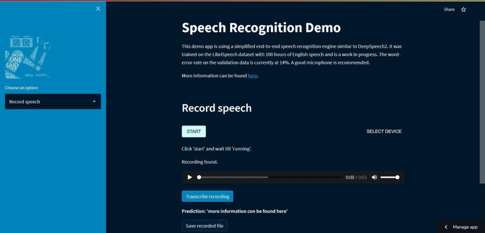

<!-- markdownlint-disable -->
# Webdemo of a Speech Recognition Engine with Streamlit and Tensorflow Lite 

This is a demo of an [end-to-end speech recognition engine](https://github.com/to-schi/speech-recognition-from-scratch) similar to DeepSpeech2. It was trained on the LibriSpeech dataset with 960 hours of English speech. The word-error-rate on the test data is currently at 10% and can be improved with a language model to 6%. 

## Options
1. Make an own recording directly from the browser
2. Upload a wav-file from your computer
3. Try out examples from the app

-> Let the engine transcribe your speech.

The app is using [streamlit_webrtc](https://github.com/whitphx/streamlit-webrtc) for audio streaming.

